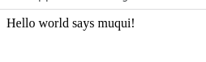

# Spring-MVC-Hello-World-NetBeans
<h3>prerequisites</h3>
<ul>
  <li>Java 11</li>
  <li>Apache NetBeans IDE 12.4</li>
  <li>Tomcat 8.5</li>
</ul>
<h3>Steps for creating Spring MVC Hello World example on NetBeans.</h3>

1)Go to File -> New Project -> Java with Maven -> Web Applicaton. 

2) You will see below screen, put name project and Groud id, again click on next.

We need to select server and Java EE version

Add spring dependency in pom.xml. We require spirng core and spring mvc dependency here.

<h3>Create Controller and view</h3>

Create a package named "com.albertocorona.helloword" create a controller class named HelloController.java

Create JSP named index.jsp in Web Pages folder. 

Modify index.jsp as below

Create folder named WEB-INF/ in Web Pages folder. 

Create hello.jsp in /WEB-INF/ folder

Modify hello.jsp as below

<h3>Configuring spring mvc application</h3>

Create xml file named "web.xml" in /WEB-INF folder as below.

Create xml file named "" in /WEB-INF folder as below.

<h3>it's time to do maven buid</h3>

Right click on project -> clean and build

 posible error as below.

 How fix it, update version maven-war-plugin in file pom.xml to 3.2.2  

After resolved the problem.

You will see below screen

When you click on above link, you will get below screen.

